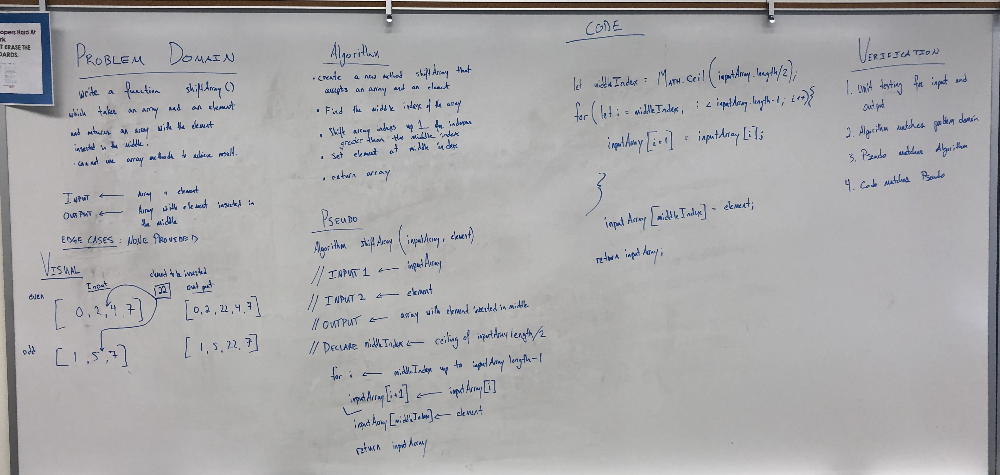

# Insert and Shift Array
An algorithm to insert and shift an array at middle index without using any built-in methods. 

## Challenge
Write a function called `insertShiftArray` which takes in an array and the value to be added. Without utilizing any of the built-in methods available to JavaScript, return an array with the new value added at the middle index. 

## Approach & Efficiency
<!-- What approach did you take? Why? What is the Big O space/time for this approach? --> 

## Solution

### Example Input and Output

|  Input      |  Output  |
|---|---|
| [2,4,6,8], 5  | [2,4,5,6,8] |
| [4,8,15,23,42], 16	  |  [4,8,15,16,23,42] |
