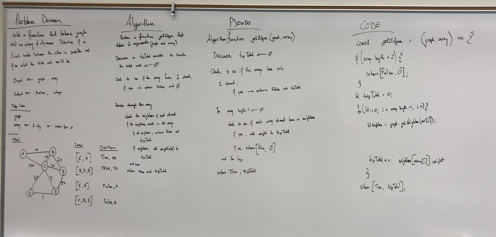

# Get Edges : Finding a path while keeping track of 

Given a business trip itinerary, and an Alaska Airlines route map, is the trip possible with direct flights? If so, how much will the total trip cost be?

## Challenge

* Write a function based on the specifications above, which takes in a graph, and an array of city names. 

* Without utilizing any of the built-in methods available to your language, return whether the full trip is possible with direct flights, and how much it would cost.

## Approach & Efficiency

1. Problem Domain accurately describes problem
2. Visual will capture the process
3. Algorithm will decribe the function
4. Pseudo code will match the Algorithm
5. Code will match the Pseudo

## Solution

* `getEdge (graph, array)` 

