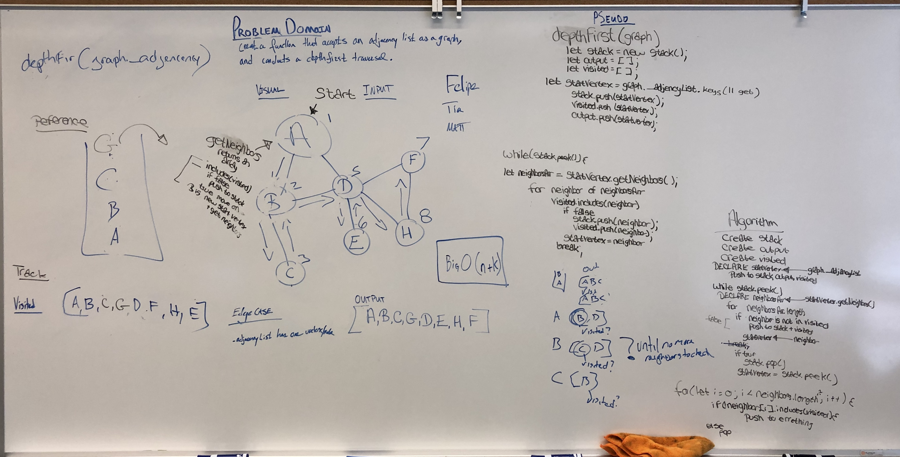
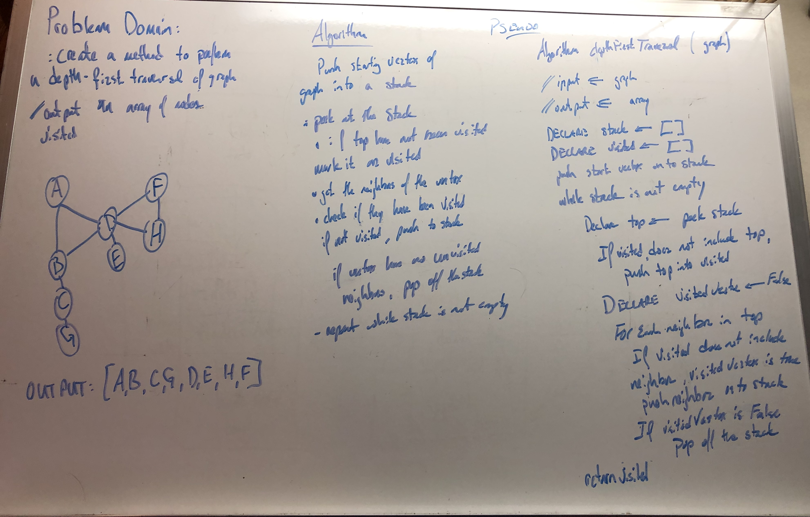

# Depth First Traversal on a Graph

Conduct a depth first preorder traversal on a graph

----

## Challenge

* Create a function that accepts an adjacency list as a graph, and conducts a depth first traversal. 

* Without utilizing any of the built-in methods available to your language, return a collection of nodes in their pre-order depth-first traversal order.

----

## Approach & Efficiency

* BigO (n + k), worst case BigO (n^2)

1. Problem Domain accurately describes problem
2. Visual will capture the process
3. Algorithm will decribe the function
4. Pseudo code will match the Algorithm
5. Code will match the Pseudo
-----

## Solution

* Depth First Search Traversal [Felipe, Tia and Matt] 

------
* Depth First Search Traversal [Matt]

______
