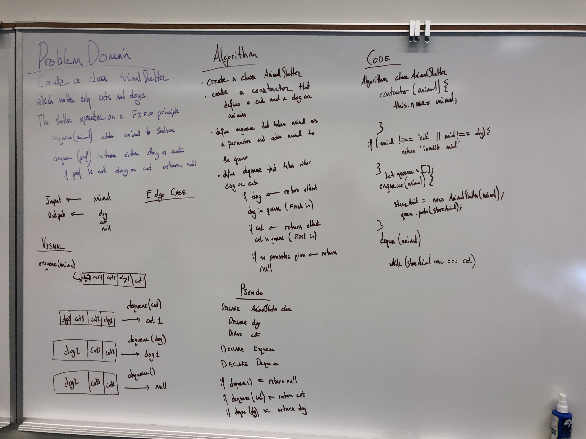

# FIFO Animal Shelter

Create a class called AnimalShelter which holds only dogs and cats. The shelter operates using a first-in, first-out approach.

## Challenge

Implement the following methods:

`enqueue(animal)`: adds animal to the shelter. animal can be either a dog or a cat object.

`dequeue(pref)`: returns either a dog or a cat. If pref is not "dog" or "cat" then return null.

## Approach & Efficiency

I reviewed the class demo, did a lot of research to learn more about Linked Lists, and then planned my project

## Methods: 

## Solution

------
------

Feature Tasks
Create a class called AnimalShelter which holds only dogs and cats. The shelter operates using a first-in, first-out approach.
Implement the following methods:
enqueue(animal): adds animal to the shelter. animal can be either a dog or a cat object.
dequeue(pref): returns either a dog or a cat. If pref is not "dog" or "cat" then return null.