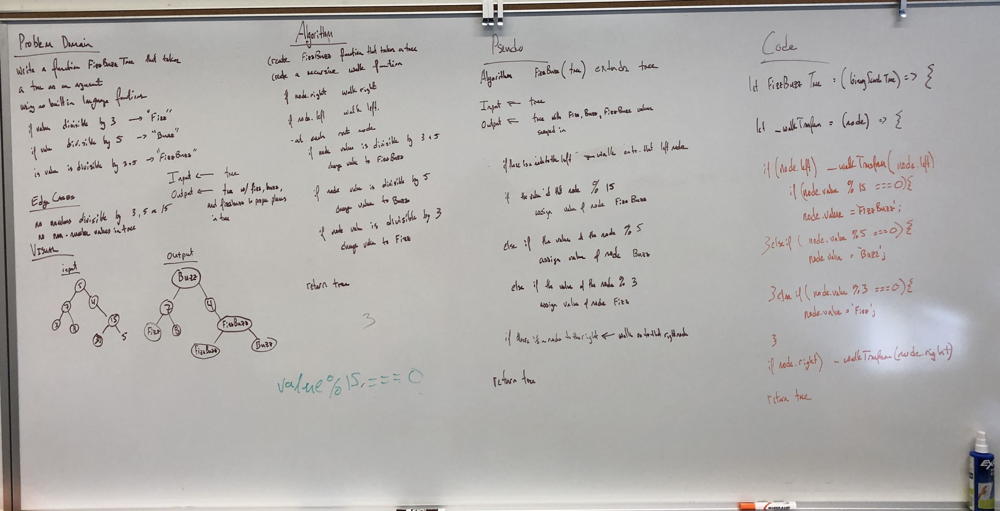

# FizzBuzz Tree Data Structures

Utilizing recursion traverse a tree and replace values, when appropriate, with Fizz, Buzz or FizzBuss

## Challenge

Write a function called FizzBuzzTree which takes a tree as an argument.
Without utilizing any of the built-in methods available to your language, determine weather or not the value of each node is divisible by 3, 5 or both, and change the value of each of the nodes. 

If the value is divisible by 3, replace the value with “Fizz”

If the value is divisible by 5, replace the value with “Buzz”

If the value is divisible by 3 and 5, replace the value with “FizzBuzz”

Return the tree with its new values.

## Approach & Efficiency

I reviewed the class demo, did a lot of research to learn more about Stacks and Queues, and then planned my project, wrote my tests, then executed the code.

All tests are passing, all the code is covered by tests.

### Solution

