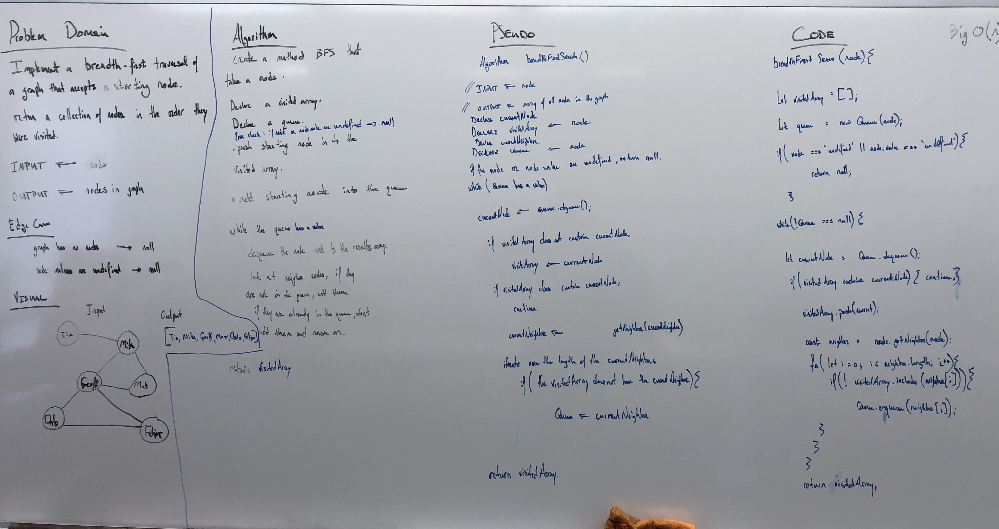

# Graph Implementation

Implement a Graph

## Challenge

* Implement your own Graph. The graph should be represented as an adjacency list, and should include the following methods:

`addNode()`
* Adds a new node to the graph
* Takes in the value of that node
* Returns the added node

`addEdge()`
* Adds a new edge between two nodes in the graph
* Include the ability to have a “weight”
* Takes in the two nodes to be connected by the edge
* Both nodes should already be in the Graph

`getNodes()`
* Returns all of the nodes in the graph as a collection (set, list, or similar)

`getNeighbors()`
* Returns a collection of nodes connected to the given node
* Takes in a given node
* Include the weight of the connection in the returned collection

`size()`
* Returns the total number of nodes in the graph

## Example

## Approach & Efficiency

I reviewed the class demo, did a lot of research to learn more about Stacks and Queues, and then planned my project, wrote my tests, then executed the code.

All tests are passing, all the code is covered by tests.

## Solution

## Structure and Testing

Utilize the Single-responsibility principle: any methods you write should be clean, reusable, abstract component parts to the whole challenge. You will be given feedback and marked down if you attempt to define a large, complex algorithm in one function definition.

Write at least three test assertions for each method that you define.

------

# Breadth First Traversal for a Graph

Implement a breadth-first traversal on a graph.

## Challenge

* Extend your graph object with a breadth-first traversal method that accepts a starting node.

* Without utilizing any of the built-in methods available to your language, return a collection of nodes in the order they were visited. 

* Display the collection.

## Approach & Efficiency

1. Problem Domain accurately describes problem
2. Visual will capture the process
3. Algorithm will decribe the function
4. Pseudo code will match the Algorithm
5. Code will match the Pseudo

## Solution

* Breadth First Search Graph 

______
