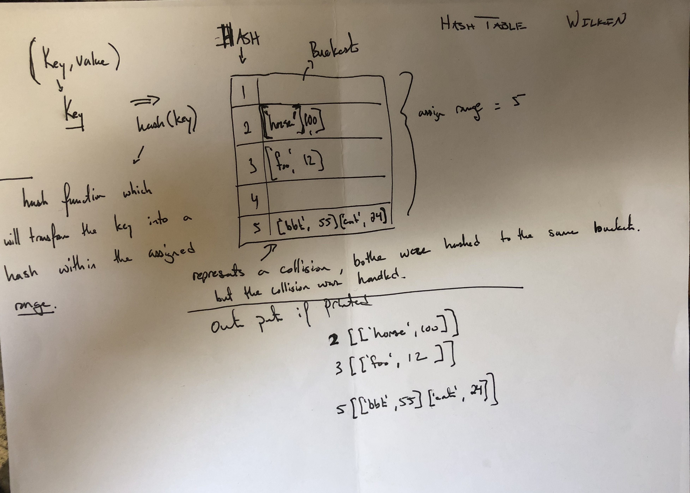

# Create a Hash Table

Create a simple implementation of a Hash Table with collision protection. 

## Challenge

Implement a Hashtable with the following methods:

* `add`: takes in both the key and value. This method should hash the key, and add the key and value pairto the table, handling collisions as needed.

* `get`: takes in the key and returns the value from the table.

* `contains`: takes in the key and returns a boolean, indicating if the key exists in the table already.

* `hash`: takes in an arbitrary key and returns an index in the collection.

## Approach & Efficiency

1. Problem Domain accurately describes problem
2. Visual will capture the process
3. Algorithm will decribe the function
4. Pseudo code will match the Algorithm
5. Code will match the Pseudo

## Solution

* Whiteboard image

