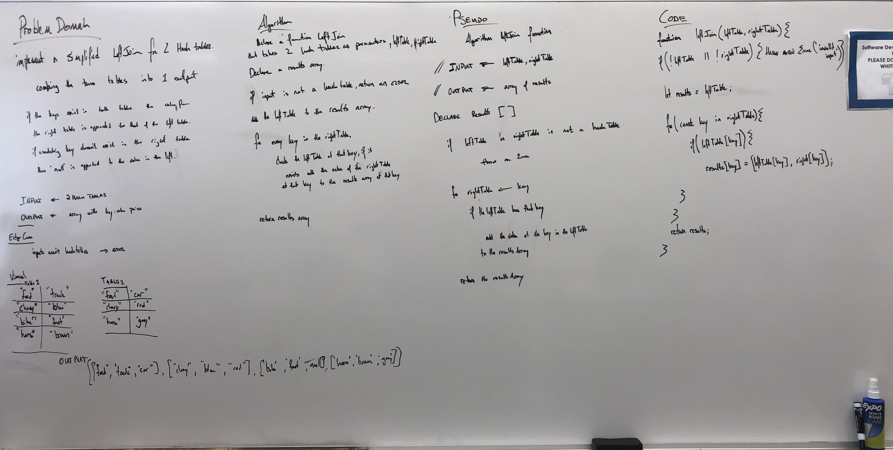

# Left Join for Two Hashmaps

Implement a simplified `LEFT JOIN` for 2 Hashmaps.

## Challenge

* Write a function that `LEFT JOIN`s two hashmaps into a single data structure.
* The first parameter is a hashmap that has word strings as keys, and a synonym of the key as values.
* The second parameter is a hashmap that has word strings as keys, and antonyms of the key as values.
* Combine the key and corresponding values (if they exist) into a new data structure according to `LEFT JOIN` logic.
* `LEFT JOIN` means all the values in the first hashmap are returned, and if values exist in the “right” hashmap, they are appended to the result row. 
* * If no values exist in the right hashmap, then some flavor of NULL should be appended to the result row.
* The returned data structure that holds the results is up to you. It doesn’t need to exactly match the output below, so long as it achieves the `LEFT JOIN` logic.
* Avoid utilizing any of the library methods available to your language.

## Example

## Approach & Efficiency

I reviewed the class demo, did a lot of research to learn more about Stacks and Queues, and then planned my project, wrote my tests, then executed the code.

All tests are passing, all the code is covered by tests.

## Solution

## Structure and Testing

Utilize the Single-responsibility principle: any methods you write should be clean, reusable, abstract component parts to the whole challenge. You will be given feedback and marked down if you attempt to define a large, complex algorithm in one function definition.

Write at least three test assertions for each method that you define.

------
