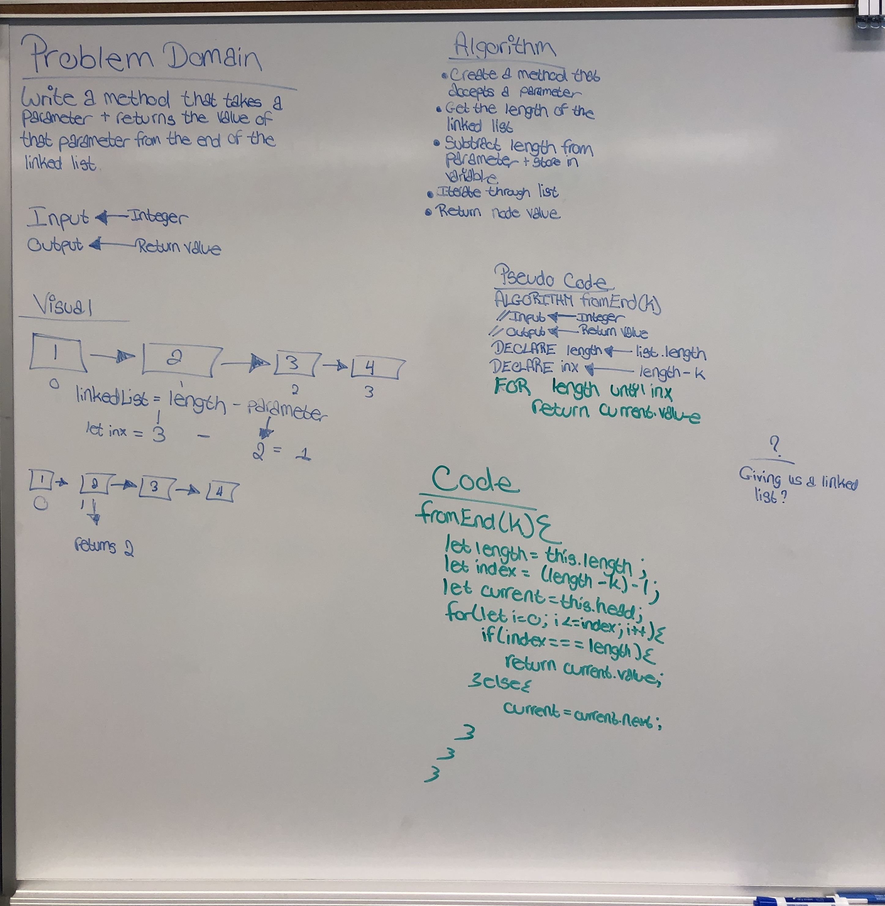

# Singly Linked List

Implementing Singly Linked List utilizing classes

## Challenge

Implement insert, includes, print, append, insertAfter, and insertBefore methods

## Approach & Efficiency

I reviewed the class demo, did a lot of research to learn more about Linked Lists, and then planned my project

## Methods: 

insert

includes

printList

append(value)

insertBefore(value, index)

insertAfter(value, index)

#### Linked List Insertions image

#### Linked List kth-from-the-end image

------
------

Code Challenge
Linked list insertions.

Specifications
Read all of these instructions carefully. Name things exactly as described.
Do all your work in a public repository called data-structures-and-algorithms, with a well-formatted, detailed top-level README.md.
Create a new branch in your repo called ll_insertions.
Your top-level readme should contain a “Table of Contents” navigation to all of your challenges and implementations so far. (Don’t forget to update it!)
Place this implementation in your Data-Structures folder within your repository.
On your branch, create…
C#: Extend your LinkedList class according to the feature tasks below.
JavaScript: Extend your LinkedList class according to the feature tasks below
Python: Extend your LinkedList class according to the feature tasks below
Java: Extend your LinkedList class according to the feature tasks below
Include any language-specific configuration files required for this challenge to become an individual component, module, library, etc.
NOTE: You can find an example of this configuration for your course in your class lecture repository.
Feature Tasks
Write the following methods for the Linked List class:

.append(value) which adds a new node with the given value to the end of the list
.insertBefore(value, newVal) which add a new node with the given newValue immediately before the first value node
.insertAfter(value, newVal) which add a new node with the given newValue immediately after the first value node
Examples
.append(value)
Input	Args	Output
head -> [1] -> [3] -> [2] -> X	5	head -> [1] -> [3] -> [2] -> [5] -> X
head -> X	1	head -> [1] -> X
.insertBefore(value, newVal)
Input	Args	Output
head -> [1] -> [3] -> [2] -> X	3, 5	head -> [1] -> [5] -> [3] -> [2] -> X
head -> [1] -> [3] -> [2] -> X	1, 5	head -> [5] -> [1] -> [3] -> [2] -> X
head -> [1] -> [2] -> [2] -> X	2, 5	head -> [1] -> [5] -> [2] -> [2] -> X
head -> [1] -> [3] -> [2] -> X	4, 5	Exception
.insertAfter(value, newVal)
Input	Args	Output
head -> [1] -> [3] -> [2] -> X	3, 5	head -> [1] -> [3] -> [5] -> [2] -> X
head -> [1] -> [3] -> [2] -> X	2, 5	head -> [1] -> [3] -> [2] -> [5] -> X
head -> [1] -> [2] -> [2] -> X	2, 5	head -> [1] -> [2] -> [5] -> [2] -> X
head -> [1] -> [3] -> [2] -> X	4, 5	Exception
Unit Tests
Utilize the Single-responsibility principle: any methods you write should be clean, reusable, abstract component parts to the whole challenge. You will be given feedback and marked down if you attempt to define a large, complex algorithm in one function definition.

You have access to the Node class and all the properties on the Linked List class.

Write tests to prove the following functionality:

Can successfully add a node to the end of the linked list
Can successfully add multiple nodes to the end of a linked list
Can successfully insert a node before a node located i the middle of a linked list
Can successfully insert a node before the first node of a linked list
Can successfully insert after a node in the middle of the linked list
Can successfully insert a node after the last node of the linked list
Unit tests must be passing before you submit your final solution code.

kth-from-the-end
### Feature Tasks

Write a method for the Linked List class which takes a number, k, as a parameter. 

Return the node’s value that is k from the end of the linked list. 

You have access to the Node class and all the properties on the Linked List class as well as the methods created in previous challenges.

Unit Tests
Where k is greater than the length of the linked list
Where k and the length of the list are the same
Where k is not a positive integer
Where the linked list is of a size 1
“Happy Path” where k is not at the end, but somewhere in the middle of the linked list