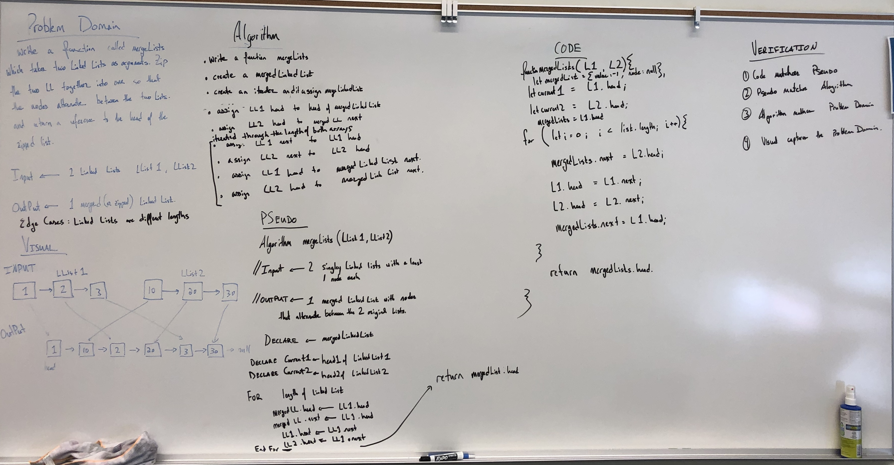

# Singly Linked List

Implementing Singly Linked List utilizing classes

## Challenge

Write a function called `mergeLists` which takes two linked lists as arguments. Zip the two linked lists together into one so that the nodes alternate between the two lists and return a reference to the head of the zipped list.

## Approach & Efficiency

I reviewed the class demo, did a lot of research to learn more about Linked Lists, and then planned my project

## Methods: 

mergeLinkedLists

#### mergeLinkedLists

-------
### Feature Tasks

Write a function called mergeLists which takes two linked lists as arguments. Zip the two linked lists together into one so that the nodes alternate between the two lists and return a reference to the head of the zipped list.

 Try and keep additional space down to O(1). 

 You have access to the Node class and all the properties on the Linked List class as well as the methods created in previous challenges.

#### Example

mergeLists(list1, list2)
Arg list1	Arg list2	Output
head -> [1] -> [3] -> [2] -> X	head -> [5] -> [9] -> [4] -> X	head -> [1] -> [5] -> [3] -> [9] -> [2] -> [4] -> X
head -> [1] -> [3] -> X	head -> [5] -> [9] -> [4] -> X	head -> [1] -> [5] -> [3] -> [9] -> [4] -> X
head -> [1] -> [3] -> [2] -> X	head -> [5] -> [9] -> X	head -> [1] -> [5] -> [3] -> [9] -> [2] -> X