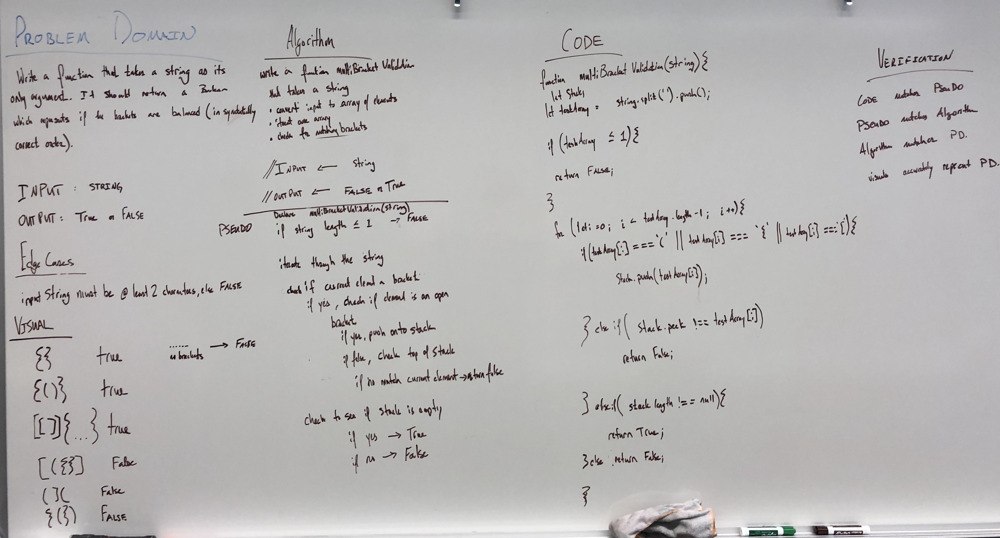

# Challenge Summary

Create a function called `multiBracketValidation(input)` that checks for proper syntax for brackets.

## Challenge Description

Your function should take a string as its only argument, and should return a boolean representing whether or not the brackets in the string are balanced. There are 3 types of brackets:

`Round Brackets : ()`

`Square Brackets : []`

`Curly Brackets : {}`

## Approach & Efficiency
<!-- What approach did you take? Why? What is the Big O space/time for this approach? -->

## Solution

### Example 

|   Input	|  Output 	|
|---	|---	|
|  {} 	|  TRUE 	|
|   {}(){}	|  TRUE	 |
|  ()[[Extra Characters]]	|  TRUE 	|
|  (){}[[]] 	|  TRUE 	|
|  {}{Code}[Fellows](())	|  TRUE 	|
|  [({}] 	|  FALSE 	|
|  (]( 	|  FALSE 	|
|  {(})	 |  FALSE 	|

Consider these small examples and why they fail.

|  Input 	|   Output	|  Why 	|
|---	|---	|---	|
|   {	|   FALSE	|  error unmatched opening { remaining. 	|
|   )	|   FALSE	|  error closing ) arrived without corresponding opening. 	|
|  [} 	|  FALSE 	|   error closing }. Doesn’t match opening (.	|