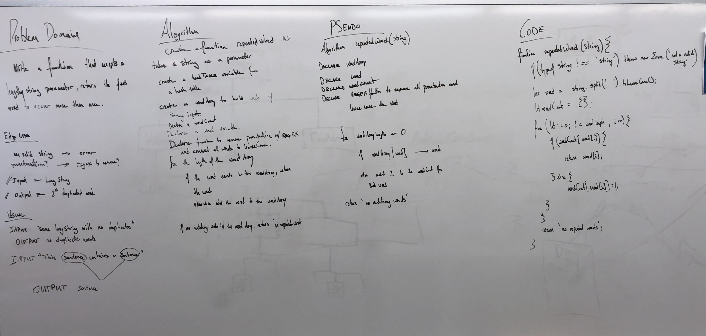

# Challenge Summary - Find Repeated Word

Find the first repeated word in a book.

## Challenge Description
* Write a function that accepts a lengthy string parameter.
* Without utilizing any of the built-in library methods available to your language, return the first word to occur more than once in that provided string.

## Approach & Efficiency

I reviewed the class demo, did a lot of research to learn more about Stacks and Queues, and then planned my project, wrote my tests, then executed the code.

All tests are passing, all the code is covered by tests.

## Solution

