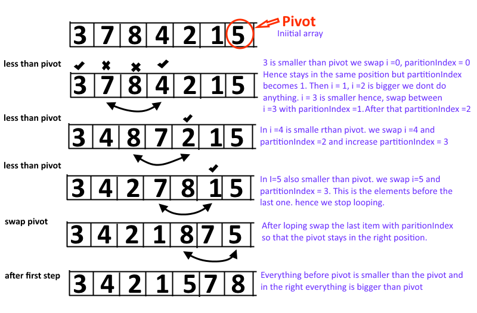

## Lecture Notes: Quick Sort

Quick sort is an efficient, general-purpose, comparison-based sorting algorithm. In efficient implementations it is not a stable sort, meaning that the relative order of equal sort items is not preserved. It can operate in-place on an array, but requires a small amount of additional memory. 

The Quick Sort Algorithm is also classified as a Divide and Conquer algorithm which runs in O(n log n), time on average with a worst case run time of O(n^2). It works well for large datasets.

### Learning Objectives

* Students will learn how to implement working code based on Pseudo code, including providing working tests to verify the stability and functionality of the code. 

* Students will learn the benefits and drawbacks of using quick sort, including when it is advantageous to use and when it is not. 

* Students will learn the run time or Big O of quick sort. 

### Lecture Flow

* Quick sort works on the divide-and-conquer principle. 

* The quick sort is regarded as the best sorting algorithm.
* * This is because of its significant advantage in terms of efficiency because it is able to deal well with a huge list of items.

* It is an unstable sorting method
* * Meaning that the relative order of equal sort items is not preserved.

* Quick sort is good for large data structures.

### Diagram

### Algorithm

* First, select an element which is to be called as pivot element.

* Next, compare all array elements with the selected pivot element and arrange them in such a way that, elements less than the pivot element are to it's left and greater than pivot is to it's right.

* Finally, perform the same operations on left and right side elements to the pivot element.

### Pseudocode

ALGORITHM QuickSort(arr, left, right)
    if left < right
        // Partition the array by setting the position of the pivot value 
        DEFINE position <-- Partition(arr, left, right)
        // Sort the left
        QuickSort(arr, left, position - 1)
        // Sort the right
        QuickSort(arr, position + 1, right)

ALGORITHM Partition(arr, left, right)
    // set a pivot value as a point of reference
    DEFINE pivot <-- arr[right]
    // create a variable to track the largest index of numbers lower than the defined pivot
    DEFINE low <-- left - 1
    for i <- left to right do
        if arr[i] <= pivot
            low++
            Swap(arr, i, low)

     // place the value of the pivot location in the middle.
     // all numbers smaller than the pivot are on the left, larger on the right. 
     Swap(arr, right, low + 1)
    // return the pivot index point
     return low + 1

ALGORITHM Swap(arr, i, low)
    DEFINE temp;
    temp <-- arr[i]
    arr[i] <-- arr[low]
    arr[low] <-- temp
    

### Readings and References

#### Watch

* [Quick Sort in Java Script](https://www.youtube.com/watch?v=0KBvaKc__rc)

#### Read

* [Implementing Quicksort in JavaScript](https://medium.com/@Charles_Stover/implementing-quicksort-in-javascript-8044a8e2bf39)

* [The Quicksort Algorithm](http://blog.benoitvallon.com/sorting-algorithms-in-javascript/the-quicksort-algorithm/)

#### Bookmark

* [JavaScript Searching and Sorting Algorithm: Quick sort](https://www.w3resource.com/javascript-exercises/searching-and-sorting-algorithm/searching-and-sorting-algorithm-exercise-1.php)