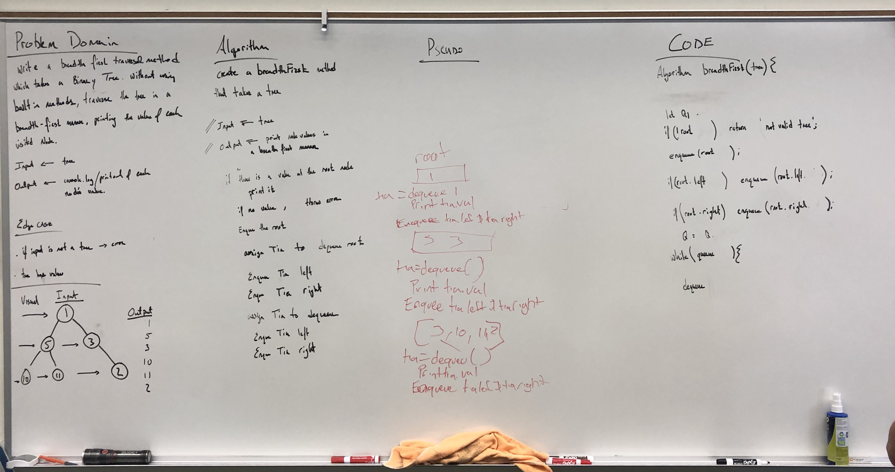
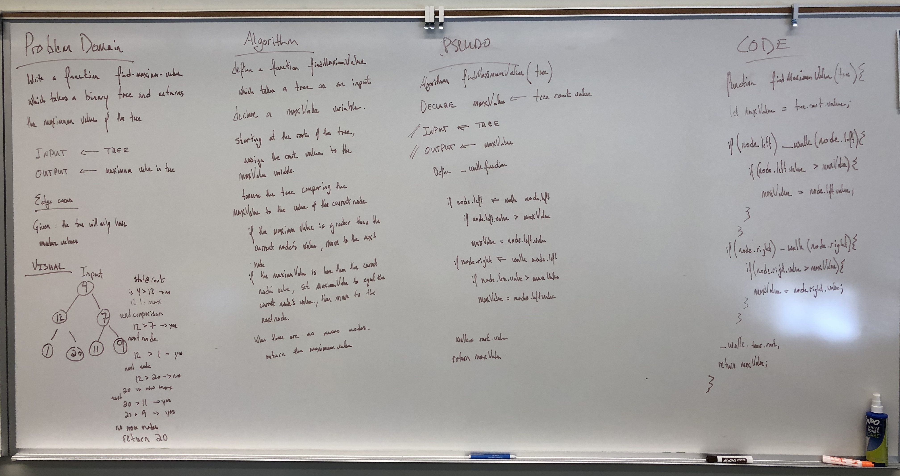

# Binary Tree and Binary Search Tree Data Structures

Explore Binary Trees and Binary Search Trees Data Structures.

## Challenge

Create a Node class that has properties for the value stored in the node, the left child node, and the right child node.

### Create a BinaryTree class

Define a method for each of the depth first traversals called `preOrder`, `inOrder`, and `postOrder` which returns an array of the values, ordered appropriately.

Write a `breadth first traversal` method which takes a Binary Tree as its unique input. Without utilizing any of the built-in methods available to your language, traverse the input tree using a Breadth-first approach; print every visited node’s value.

### Create a BinarySearchTree class

Define a method named `add` that accepts a value, and adds a new node with that value in the correct location in the binary search tree.

Define a method named `contains` that accepts a value, and returns a boolean indicating whether or not the value is in the tree at least once.

### Find the Maximum Value in a Binary Tree

Write a function called `find-maximum-value` which takes binary tree as its only input. 

Without utilizing any of the built-in methods available to your language, return the maximum value stored in the tree. 

You can assume that the values stored in the Binary Tree will be numeric.

## Approach & Efficiency

1. Problem Domain accurately describes problem
2. Visual will capture the process
3. Algorithm will decribe the function
4. Pseudo code will match the Algorithm
5. Code will match the Pseudo

## Solution

* Breadth First Search 

* Find Maximum Value 

