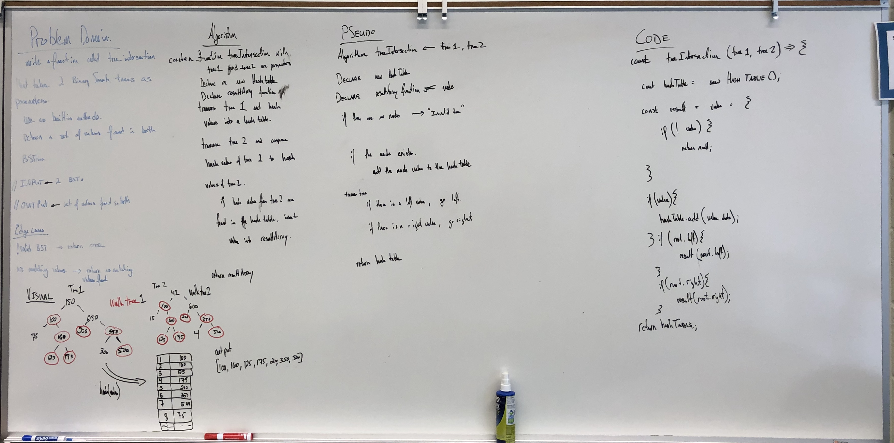

# Tree Intersection - Binary Search Tree

Find common values in 2 binary trees.

## Challenge

* Write a function called `tree_intersection` that takes two binary tree parameters.
* Without utilizing any of the built-in library methods available to your language, return a set of values found in both trees.

## Approach & Efficiency

1. Problem Domain accurately describes problem
2. Visual will capture the process
3. Algorithm will decribe the function
4. Pseudo code will match the Algorithm
5. Code will match the Pseudo

## Solution

* Tree Intersection

